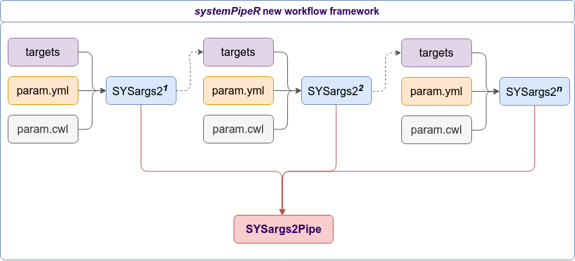

```{r, echo=FALSE}
knitr::opts_chunk$set(
  collapse = TRUE,
  comment = "#>"
)
```

# *systemPipeR*

## *systemPipeR*'s New CWL Command-line Interface

Computational workflows are becoming increasingly crucial for advanced scientific research, mainly because of the amount of data output by next-generation sequencing technologies. Reproducibility and scalable are the primary concern when a research workflow is designed. Workflows typically are composed of multiple software tools, or pipelines, each with a specific set of parameters, a different configuration of the input data and also the output results, which may determine the analysis reproducibility. Although several tools for managing and executing workflow systems are available, they are designed to offer a specific set of functionalities. To address this need, we have developed a new tool, `SYSargs2` an S4 Class, to create and run workflows with `systempipeR` package, integrating the [Common Workflow Language](https://www.commonwl.org/) (CWL), which provide a standard for describing analysis workflows in a generic and reproducible manner.
*systemPipeR* is an extensible environment for both building and running end-to-end analysis workflows with automated report generation for a wide range of NGS applications. Its unique features include a consistent workflow interface across different NGS applications, automated report generation, and support for running both R and command-line software on local computers and computer clusters. A flexible sample annotation infrastructure efficiently handles complex sample sets and experimental designs. `SYSargs2` allows creating more generalized, flexible, and robust workflows, achieving a better user interface. 

## Getting Started

### Installation

The R software for running [*`systemPipeR`*](http://www.bioconductor.org/packages/devel/bioc/html/systemPipeR.html) can be downloaded from [_CRAN_](http://cran.at.r-project.org/). The *`systemPipeR`* environment can be installed from the R console using the [*`BiocManager::install`*](https://cran.r-project.org/web/packages/BiocManager/index.html) command. The associated data package [*`systemPipeRdata`*](https://github.com/tgirke/systemPipeRdata) can be installed the same way. The latter is a helper package for generating *`systemPipeR`* workflow environments with a single command containing all parameter files and sample data required to quickly test and run workflows. 

```{r install2, eval=FALSE}
if (!requireNamespace("BiocManager", quietly=TRUE)) install.packages("BiocManager")
BiocManager::install("systemPipeR")
BiocManager::install("systemPipeRdata")
```

### Loading package and documentation

```{r documentation, eval=TRUE}
suppressPackageStartupMessages({
library("systemPipeR") # Loads the package
library(help="systemPipeR") # Lists package info
#vignette("systemPipeR") # Opens vignette
})
```

### Load sample data and workflow templates

The mini sample FASTQ files used by this overview vignette as well as the associated workflow reporting vignettes can be loaded via the *`systemPipeRdata`* package as shown below. The chosen data set [`SRP010938`](http://www.ncbi.nlm.nih.gov/sra/?term=SRP010938) contains 18 paired-end (PE) read sets from *Arabidposis thaliana* [@Howard2013-fq]. To minimize processing time during testing, each FASTQ file has been subsetted to 90,000-100,000 randomly sampled PE reads that map to the first 100,000 nucleotides of each chromosome of the *A. thalina* genome. The corresponding reference genome sequence (FASTA) and its GFF annotion files (provided in the same download) have been truncated accordingly. This way the entire test sample data set requires less than 200MB disk storage space. A PE read set has been chosen for this test data set for flexibility, because it can be used for testing both types of analysis routines requiring either SE (single end) reads or PE reads. 

The following generates a fully populated *`systemPipeR`* workflow environment (here for RNA-Seq) in the current working directory of an R session. At this time the package includes workflow templates for RNA-Seq, ChIP-Seq, VAR-Seq and Ribo-Seq. Templates for additional NGS applications will be provided in the future.

```{r genRna_workflow, eval=FALSE}
library(systemPipeRdata)
genWorkenvir(workflow="rnaseq")
setwd("rnaseq")
```

### Directory structure

The working environment of the sample data loaded in the previous step contains the following preconfigured directory structure. Directory names are indicated in  <span style="color:grey">***green***</span>. Users can change this structure as needed, but need to adjust the code in their workflows accordingly. 

* <span style="color:green">_**workflow/**_</span> (*e.g.* *rnaseq/*) 
  + This is the directory of the R session running the workflow.
  + Run script ( *\*.Rmd*) and sample annotation (*targets.txt*) files are located here.
  + Note, this directory can have any name (*e.g.* <span style="color:green">_**rnaseq**_</span>, <span style="color:green">_**varseq**_</span>). Changing its name does not require any modifications in the run script(s).
  + **Important subdirectories**: 
  + <span style="color:green">_**param/**_</span> 
      + Stores parameter files such as: *\*.param*, *\*.tmpl* and *\*\*run.sh*
      + <span style="color:green">_**param/cwl/**_</span>: This subdirectory stores all the CWL parameter files. Note, which workflow can have one subdirectory and all the  \code{CWL param} and \code{input.yml} files need to be in the same subdirectory. 
  + <span style="color:green">_**data/**_ </span>
    + FASTQ samples 
    + Reference FASTA file
    + Annotations
    + etc.
  + <span style="color:green">_**results/**_</span>
    + Alignment, variant and peak files (BAM, VCF, BED) 
    + Tabular result files
    + Images and plots
    + Note, the user has the option to create a subdirectory for each *`SYSargs2`* instance, which store all the results files for the particular analysis for each sample.


<div align="center">Figure 1: *systemPipeR* preconfigured directory structure.</div></br>

The following parameter files are included in each workflow template:

1. *`targets.txt`*: initial one provided by user; downstream *`targets_*.txt`* files are generated automatically;
2. *`*.param/cwl`*: defines parameter for input/output file operations, *e.g.*:
    + *`hisat2-se/hisat2-mapping-se.cwl`* 
    + *`hisat2-se/hisat2-mapping -se.yml`*
3. *`*_run.sh`*: optional bash script, *e.g.*: *`gatk_run.sh`*;
4. Compute cluster environment (skip on single machine):
    + *`.batchtools.conf.R`*: defines the type of scheduler for *`batchtools`*. Note, it is necessary to point the right template accordingly to the cluster in use, and the file needs to be placed in the home directory ("~");
    + *`*.tmpl`*: specifies parameters of scheduler used by a system, *e.g.* Torque, SGE, Slurm, etc.

## *systemPipeR* new workflow framework

The introduction of the new workflow control class, *`SYSargs2`* an R S4 class (see Figure 2), improve *systemPipeR* user interface. The workflows can be designed by connecting *`SYSargs2`* workflow control modules. The *`SYSargs2`* new design interconnecting with CWL allows running many steps in only one instance. The central connectivity among all the steps in only one instance or between modules are the input/output information shared with directly connected workflow steps. Each of *`SYSargs2`* container can be independent or connected. *`SYSargs2`* objects stores all the information and instructions needed for processing a set of input files with a specific command-line or a series of command-line within a workflow.
We also introduce a new class which is able to store and manage all the *`SYSargs2`* containers, *`SYSargs2Pipe`*, an R S4 class. *`SYSargs2Pipe`* stores a list  *`SYSargs2`* objects. 


<div align="justify">Figure 2: Workflow steps with input/output file operations are controlled by  *`SYSargs2`* objects. Each *`SYSargs2`* instance is constructed from targets and two param file. The only input provided by the user is the initial targets file. Subsequent targets instances are created automatically. Any number of predefined or custom workflow steps are supported. All *`SYSargs2`* container can be stored and managed form *`SYSargs2Pipe`* instance.</div></br>

### Structure of *`SYSargs2`* container

#### Structure of *`targets`* file

The *`targets`* file defines all input files (*e.g.* FASTQ, BAM, BCF) and sample comparisons of an analysis workflow. The following shows the format of a sample *`targets`* file included in the package. It also can be viewed and downloaded from *`systemPipeR`*'s GitHub repository [here](https://github.com/tgirke/systemPipeR/blob/master/inst/extdata/targets.txt). In a target file with a single type of input files, here FASTQ files of single end (SE) reads, the first three columns are mandatory including their column names, while it is four mandatory columns for FASTQ files of PE reads. All subsequent columns are optional and any number of additional columns can be added as needed.

```{r targetsSE, eval=TRUE}
library(systemPipeR)
targetspath <- system.file("extdata", "targets.txt", package="systemPipeR") 
read.delim(targetspath, comment.char = "#")[1:4,1:4]
```

To work with custom data, users need to generate a *`targets`* file containing the paths to their own FASTQ files and then provide under *`targetspath`* the path to the corresponding *`targets`* file. 
Sample comparisons are defined in the header lines of the *`targets`* file starting with '``# <CMP>``'. 

```{r comment_lines, echo=TRUE}
readLines(targetspath)[1:4]
```

The function *`readComp`* imports the comparison information and stores it in a *`list`*. Alternatively, *`readComp`* can obtain the comparison information from the corresponding *`SYSargs2`* object (see below). 
Note, these header lines are optional. They are mainly useful for controlling comparative analyses according to certain biological expectations, such as identifying differentially expressed genes in RNA-Seq experiments based on simple pair-wise comparisons.
 
```{r targetscomp, eval=TRUE}
readComp(file=targetspath, format="vector", delim="-")
```

#### How to build *`SYSargs2`* cointainer

*`SYSargs2`* stores all the information and instructions needed for processing a set of input files with a specific command-line or a series of command-line within a workflow. The *`SYSargs2`* S4 class object is created from the *loadWorkflow* and *renderWF* function, which populates all the command-line for each sample in each step of the particular workflow. Each sample level input/outfile operation uses its own *`SYSargs2`* instance. The output of *`SYSargs2`* define all the expected output files for each step in the workflow, which usually it is the sample input for the next step in an *`SYSargs2`* instance (see Figure 2). Between different instances, this connectivity is established by writing the subsetting output with the *writeTargetsout* function to a new targets file that serves as input to the next *loadWorkflow* and *renderWF* call. By chaining several *`SYSargs2`* steps together one can construct complex workflows involving many sample-level input/output file operations with any combination of command-line or R-based software.

The *`.cwl`* files defines the parameters of a chosen command-line software. The following shows the format of a sample *`hisat2-mapping-se.cwl`* file provided by this package. 

```{r SYSargs2_structure, eval=TRUE}
library(systemPipeR)
targets <- system.file("extdata", "targets.txt", package="systemPipeR")
dir_path <- system.file("extdata/cwl/hisat2-se", package="systemPipeR")
WF <- loadWorkflow(targets=targets, wf_file="hisat2-mapping-se.cwl",
                   input_file="hisat2-mapping-se.yml",
                   dir_path=dir_path)

WF <- renderWF(WF, inputvars=c(FileName="_FASTQ_PATH_", SampleName="_SampleName_"))
```

Several accessor methods are available that are named after the slot names of the *`SYSargs2`* object. 

```{r names_WF, eval=TRUE}
names(WF)
```

Of particular interest is the *`cmdlist()`* method. It constructs the system
commands for running command-lined software as specified by a given *`.cwl`*
file combined with the paths to the input samples (*e.g.* FASTQ files) provided
by a *`targets`* file. The example below shows the *`cmdlist()`* output for
running HISAT2 on the first SE read sample. Evaluating the output of
*`cmdlist()`* can be very helpful for designing and debugging *`.cwl`* files
of new command-line software or changing the parameter settings of existing
ones.  

```{r cmdlist, eval=TRUE}
cmdlist(WF)[1]
modules(WF)
targets(WF)[1]
targets.as.df(targets(WF))[1:4,1:4]
output(WF)[1]
cwlfiles(WF)
inputvars(WF)
infile1(WF)[1:4]
```

### Showcase Workflow with `HISAT2`

#### Read mapping with `HISAT2`

The NGS reads of this project will be aligned against the reference
genome sequence using `Hisat2` [@Kim2015-ve]. The parameter settings of the aligner are defined in the `workflow_hisat2-se.cwl` and `workflow_hisat2-se.yml` files.

```{r hisat_alignment2, eval=TRUE}
## Paired-End data - HISAT2 only
targetsPE <- system.file("extdata", "targetsPE.txt", package="systemPipeR")
dir_path <- system.file("extdata/cwl/hisat2-pe", package="systemPipeR")
align <- loadWorkflow(targets=targetsPE, wf_file="hisat2-mapping-pe.cwl",
                   input_file="hisat2-mapping-pe.yml",
                   dir_path=dir_path)
align <- renderWF(align, inputvars=c(FileName1="_FASTQ_PATH1_", FileName2="_FASTQ_PATH2_", SampleName="_SampleName_"))
align

## Paired-End data - HISAT2 workflow (Hisat2 and Samtools)
dir_path <- system.file("extdata/cwl/workflow-hisat2-pe", package="systemPipeR")
WF <- loadWorkflow(targets=targetsPE, wf_file="workflow_hisat2-pe.cwl",
                   input_file="workflow_hisat2-pe.yml",
                   dir_path=dir_path)
WF <- renderWF(WF, inputvars=c(FileName1="_FASTQ_PATH1_", FileName2="_FASTQ_PATH2_", SampleName="_SampleName_"))
WF
```

Subsetting *`SYSargs2`* class slots for each workflow step.

```{r subset, eval=TRUE}
## Testing subset_wf function
subsetWF(WF, slot="input", subset='FileName1')
subsetWF(WF, slot="output", subset=2)[1:2]
subsetWF(WF, slot="output", subset="samtools-index.cwl")[1:2]
subsetWF(WF, slot="step", subset=1)[1] ## subset all the HISAT2 commandline 
subsetWF(WF, slot="output", subset=1, delete=TRUE)[1] ##DELETE
```

Execute *`SYSargs2`* on a single machine without submitting to a queuing system of a compute cluster. This way the input FASTQ files will be processed sequentially.

```{r runCommandline_WF, eval=FALSE}
library(systemPipeR)
runCommandline(WF) ## creates the files in the ./results folder
runCommandline(WF, dir=TRUE) ## creates the files in the ./results/workflowName/Samplename folder
runCommandline(WF, dir=TRUE, make_bam = TRUE) ##if it uses the workflow with samtools, should not uses make_bam=TRUE
```

Check and update the output location if necessary.

```{r output, eval=FALSE}
WF <- output_update(WF, dir=TRUE) ## Updates the output(WF) to the right location in the subfolders
WF <- output_update(WF, dir=TRUE, replace = ".bam") ## Updates the output(WF) to the right location in the subfolders
output(WF)
```

Check whether all BAM files have been created.

```{r WF_track, eval=FALSE}
WF_track <- run_track(WF_ls = c(WF))
names(WF_track)
WF_steps(WF_track)
track(WF_track)
summaryWF(WF_track)
```

Parallelization of read/alignment stats via scheduler (*e.g.* Slurm) across several compute nodes.

```{r clusterRun, eval=FALSE}
library(batchtools)
resources <- list(walltime=120, ntasks=1, ncpus=4, memory=1024)
reg <- clusterRun2(WF, FUN=runCommandline2, conffile = ".batchtools.conf.R", template = "batchtools.slurm.tmpl", Njobs=4, runid="01", resourceList=resources)
getStatus(reg=reg)

WF <- output_update(WF, dir=TRUE) ## Updates the output(WF) to the right location in the subfolders
output(WF)
```

### Read and alignment stats

The following provides an overview of the number of reads in each sample
and how many of them aligned to the reference.

```{r align_stats, eval=FALSE}
read_statsDF <- alignStats(args=WF) 
write.table(read_statsDF, "results/alignStatsWF.xls", row.names=FALSE, quote=FALSE, sep="\t")
read_statsDF
```

### Write *`new targets files`*

To establish the connectivity between different instances, it is possible by writing the subsetting output with the *`writeTargetsout`* function to a new targets file that serves as input to the next *`loadWorkflow`* and *`renderWF`* call.

```{r writeTargetsout, eval=FALSE}
names(WF$clt)
writeTargetsout(x=WF, file="default", step=1)
```

# Version Information

```{r sessionInfo}
sessionInfo()
```

# References